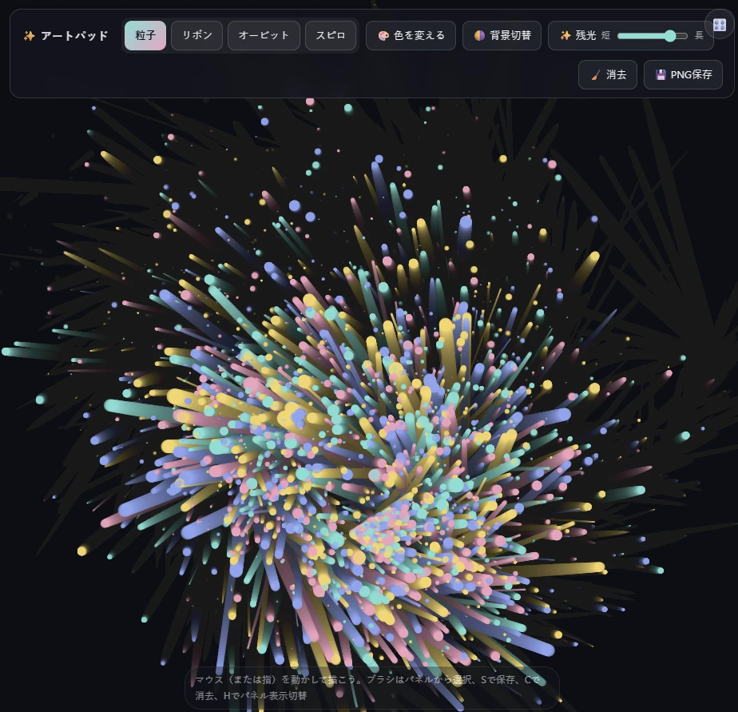

# generative-art-sketchpad

ブラウザだけで動く、ジェネレーティブ・アート用のスケッチパッドです。
マウス(または指)を動かすだけで、粒子や幾何学模様が生まれ、光の尾を引きながらゆっくり消えていきます。

作者：Mono2qry（モノつくり）



## 概要

`generative-art-sketchpad/index.html` を開くだけで動作する単一HTMLファイルのアプリです。
外部依存やビルド手順は不要で、ブラウザにドラッグ&ドロップ、またはローカルサーバー経由で開けばすぐに使えます。

## 機能紹介

### 4種類のブラシ

| ブラシ | 動き |
|---|---|
| 粒子 | 動かした向きと反対側へ粒子が噴き出します。速く動かすほど、たくさん、大きく飛び散ります。 |
| リボン | 軌跡が帯になって残ります。速く動かすほど太くなり、ところどころに光の粒がきらめきます。 |
| オービット | カーソルの周りを3つの光点が回ります。中心とは細い線でつながります。 |
| スピロ | スピログラフ(内サイクロイド)の曲線が、カーソルを中心に描かれます。 |

### 残光

描いた線はすぐには消えず、光の尾を引いてゆっくり薄れていきます。
ツールバーの「残光」スライダーで、消える速さを調整できます。右に動かすほど長く残り、いちばん右ではほとんど消えません。

### 色と背景

- **色を変える**：7種類のカラーパレットを、ボタンを押すたびに順番に切り替えます。
- **背景切替**：ダークとライトの背景を切り替えます。

### 保存と消去

- **PNG保存**：いま表示されている絵を、PNG画像として保存します。
- **消去**：キャンバスを白紙(背景色)に戻します。

### キーボードショートカット

| キー | 動作 |
|---|---|
| `S` | PNGとして保存 |
| `C` | キャンバスを消去 |
| `H` | ツールバーの表示/非表示 |

ツールバーは、右上のボタンでも表示/非表示を切り替えられます。作品を眺めたいときに便利です。

### タッチ操作

スマートフォンやタブレットの指の動きにも対応しています。

## 使い方

1. `generative-art-sketchpad/index.html` をブラウザで開く
2. ツールバーでブラシを選ぶ
3. キャンバス上でマウス(または指)を動かして描く
4. 気に入った絵ができたら、残光が消える前に「PNG保存」(または `S` キー)で保存する

## ファイル構成

```
generative-art-sketchpad/
  index.html   # アプリ本体(HTML/CSS/JSを1ファイルにまとめたもの)
```

## ライセンス

[MIT License](LICENSE)
